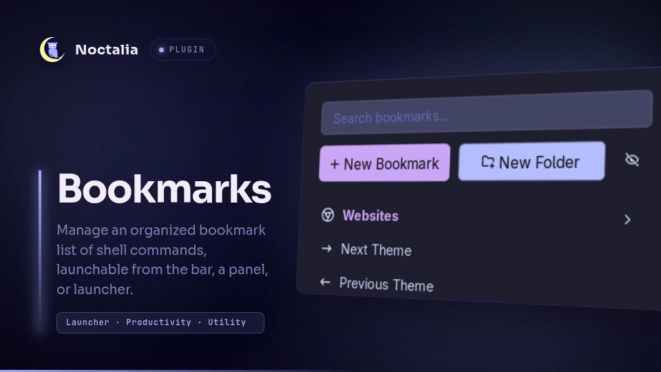
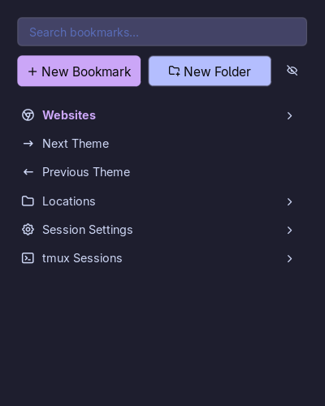
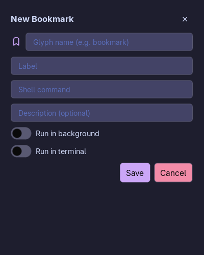
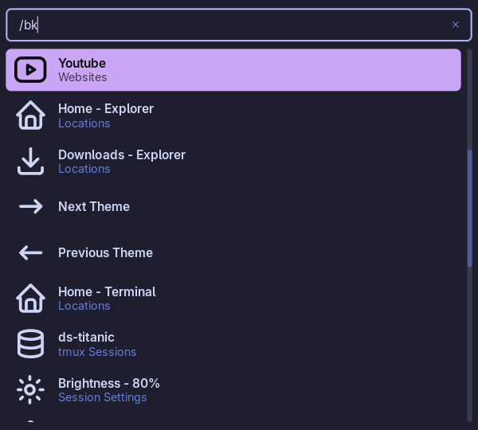

# Bookmarks



A user-managed bookmarks plugin for Noctalia. You can add bookmarks by selecting a glyph, a label,
and a shell command to execute. You can backup your bookmarks as well!

## Plugin

| Field           | Value                                                             |
| --------------- | ----------------------------------------------------------------- |
| ID              | `dunarand/bookmarks`                                              |
| Entries         | Bar widget: `bar`; panel: `panel`; Launcher provider: `provider`; |
| Launcher Prefix | `/bk`                                                             |

## Requirements

- Noctalia v5.0.0 or higher
- `nohup` (Optional): For "Run in background" wrapper toggle

## IPC & Keybinds

1. Open the bookmarks panel:

   ```sh
   noctalia msg panel-toggle dunarand/bookmarks:panel
   ```

2. Open the bookmarks panel in search mode (immediately puts you into search mode) so that you can
   use your bookmarks panel as a launcher:

   ```sh
   noctalia msg panel-toggle dunarand/bookmarks:panel search
   ```

You can interact with the bookmarks list via keybinds:

| Keybind                   | Purpose                                                          |
| ------------------------- | ---------------------------------------------------------------- |
| `CTRL + J` or Down Arrow  | Select the next (below) item                                     |
| `CTRL + K` or Up Arrow    | Select the previous (above) item                                 |
| `CTRL + H` or Left Arrow  | Return to the root level when in a folder                        |
| `CTRL + L` or Right Arrow | Get into a folder                                                |
| `CTRL + F`                | Search bookmarks                                                 |
| `CTRL + N`                | New bookmark                                                     |
| `Enter` / `Return`        | Execute the selected bookmark's command / Navigate into a folder |

## Usage

The plugin ships a bar widget, a panel, and a launcher provider. The bar widget just launches the
panel. The panel is able to be toggled via IPC. For example, in Hyprland v0.55 or higher, you can
assign it to a keybind as follows:

```
hl.bind(
    "SUPER + SHIFT + B",
    hl.dsp.exec_cmd("noctalia msg panel-toggle dunarand/bookmarks:panel")
)
```

- Bookmarks and folders are listed in the main panel.

  

- You can create or edit bookmarks by assigning them a glyph, a label, a command, and an
  optional description.

  

  - "Run in background" toggle wraps the command you defined in the following way:

    `nohup <bookmark-command> >/dev/null 2>&1 &`

    For example, instead of typing the whole command

    `nohup xdg-open "$HOME" >/dev/null 2>&1 &`

    each time, you can instead define the command as `xdg-open "$HOME"` and toggle "Run in
    background" switch.

  - "Run in terminal" switch executes the command with the default terminal. These switches are
    mutually exclusive so you can only choose one. Toggling on a switch will result the other to
    turn off.

- You can create folders and nest other bookmarks within folders.

  Folders cannot nest other folders. This is by design and it'll not change unless I find a
  genuine use case. You can edit folders by clicking on the "pen" icon next to its name.

- You can press the "eye" icon to enter edit mode where you can edit, delete, and reorder bookmarks.
  This is a setting that you can disable.

  

- You can also use your launcher to query your bookmarks with the `/bk` prefix.

  
  - Queries are folder-aware, meaning if you nested a bookmark inside a folder, the folder name will
    be displayed as well.

## Bookmarks Data

The saved bookmarks are written to `$NOCTALIA_STATE_HOME/plugins/data/dunarand/bookmarks/data.json`.
By default, `$NOCTALIA_STATE_HOME` should point to `~/.local/state/noctalia`. You can point to a
different location for saving and backing up your bookmarks. This setting is configurable via
**plugin settings** under Settings -> Plugins. Only JSON format is accepted.

You can manage the bookmark data via external scripts.

**Root**

```
[ <entry>, <entry>]
```

The root is a JSON array of entries. Order in the array is display order (used directly by drag-and
drop reordering).

**Entry**

Two types of entries exist: `bookmark` and `folder`.

### Bookmarks

```JSON
{
  "type": "bookmark",
  "glyph": "bookmark",
  "label": "My Bookmark",
  "cmd": "firefox",
  "description": "Opens Firefox",
  "runInBackground": false,
  "runInTerminal": false
}
```

| Key                                               | Type    | Required / Default                          | Notes                                           |
| ------------------------------------------------- | ------- | ------------------------------------------- | ----------------------------------------------- |
| `type`                                            | string  | `"bookmark"`                                |                                                 |
| `glyph`                                           | string  | falls back to `"bookmark"` if empty/missing |                                                 |
| `label`                                           | string  | required, enforced at save time             | `""` fails validation                           |
| `cmd`                                             | string  | required for bookmarks                      | shell command to execute, enforced at save time |
| `description`                                     | string  | optional, defaults to `""`                  | shown in the info tooltip if enabled            |
| `runInBackground`                                 | boolean | optional, defaults to `false`               | mutually exclusive with `runInTerminal` in      |
| the UI but the schema itself doesn't enforce that |
| `runInTerminal`                                   | boolean | optional, defaults to `false`               |

### Folders

```JSON
{
  "type": "folder",
  "glyph": "folder",
  "label": "My Folder",
  "items": [ <bookmark>, <bookmark>, ... ]
}
```

| Key                                  | Type   | Required/Default                                                        | Notes      |
| ------------------------------------ | ------ | ----------------------------------------------------------------------- | ---------- |
| `type`                               | string | `"folder"`                                                              |
| `glyph`                              | string | falls back to `"folder"` if empty/missing                               |
| `label`                              | string | required                                                                |
| `items`                              | array  | optional, treated as `{}` if missing, `folder.items=folder.items or {}` | contents — |
| bookmarks only, one level of nesting |

## Settings

The bar widget has the following settings:

| Setting   | Type     | Default     | Description                      |
| --------- | -------- | ----------- | -------------------------------- |
| `glyph`   | `glyph`  | `bookmark`  | Glyph displayed on the bar       |
| `tooltip` | `string` | `Bookmarks` | Tooltip displayed on the bar     |
| `text`    | `string` | `Bookmarks` | Widget text displayed on the bar |

The plugin itself has the following settings:

| Setting              | Type     | Default     | Description                                                                           |
| -------------------- | -------- | ----------- | ------------------------------------------------------------------------------------- |
| `data_path`          | `file`   |             | data.json file to store the saved bookmarks. Leave empty to use the default location. |
| `show_info_button`   | `bool`   | `true`      | Shows the "?" tooltip button on the bookmark entries.                                 |
| `enable_bk_provider` | `bool`   | `true`      | Enable bookmarks launcher provider                                                    |
| `bk_sort_by`         | `select` | `"history"` | Provider's sorting strategy. Options: `"history"`, `"usage_count"`                    |

## Changelog

### v1.3.0

- Added `/bk` launcher provider
- Changed the following keybinds (check IPC & Keybinds section for what they do)
  - CTRL + N changed to CTRL + J
  - CTRL + P changed to CTRL + K
  - CTRL + S changed to CTRL + F
- Added the following keybinds (check IPC & Keybinds section for what they do)
  - CTRL + H or Left Arrow
  - CTRL + L or Right Arrow
  - CTRL + N
- Index tracking on root level for keyboard-centric usage
  - Previously, when using a keyboard to navigate, going into a folder would reset the selected
    entry's index to 1 causing fat fingers to be annoying
