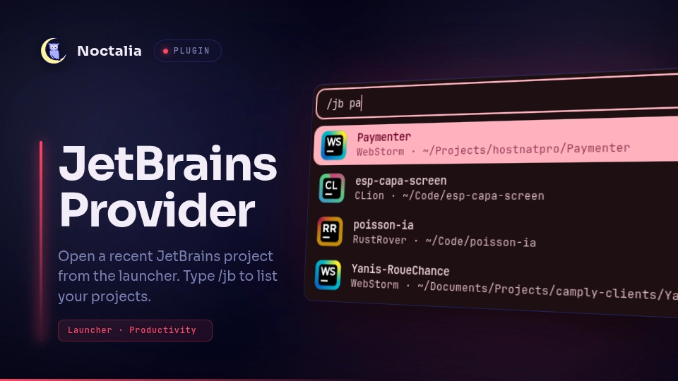

# JetBrains Provider

JetBrains Provider integrates recent projects from supported JetBrains-based IDEs
with the Noctalia launcher so you can reopen a project quickly without leaving
the shell.

## Plugin

| Field | Value |
| --- | --- |
| ID | `cleboost/jetbrains-provider` |
| Entry | Launcher provider: `provider` |
| Launcher Prefix | `/jb` |

## Requirements

Install at least one supported IDE (via Toolbox or standalone). The plugin uses
`bash` and `awk` to scan recent-project files and `nohup` to launch IDEs in the
background.

## Usage

Open the Noctalia launcher and type `/jb` to list recent projects from your
installed IDEs. Continue typing to filter projects by name, then select one to
open it with the IDE that last used it.

## Supported IDEs

IntelliJ IDEA (Ultimate and Community `IdeaIC`), Android Studio, WebStorm,
CLion, GoLand, RustRover, PyCharm (including Community `PyCharmCE`), PhpStorm,
RubyMine, DataGrip, and Rider.

## Settings

- `config_dir` — root directory for JetBrains IDE configuration folders.
- `toolbox_dir` — JetBrains Toolbox apps directory used to locate IDE launchers.
- `max_results` — maximum number of projects shown in the launcher.
- `ignored_ides` — IDE names to exclude (e.g. `WebStorm`, `CLion`).

## Notes

Projects are read from each IDE's `recentProjects.xml`, typically under
`~/.config/JetBrains/<Product><Version>/options/`. When the same project
appears in multiple IDEs, only the most recently activated entry is shown.
Backup config folders and ignored IDEs are skipped. The list is cached for the
launcher session and refreshed when you clear the query.
