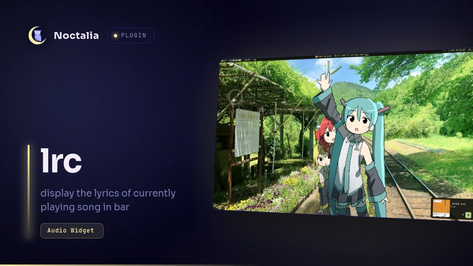

# LRC

Displays current song lyrics on the bar widget via `lrc_tty`. Works with MPD and Spotify.

## Plugin

| Field | Value |
| --- | --- |
| ID | `shin/lrc` |
| Entries | Bar widget: `lrc` |

## Requirements

- `lrc_tty` — fetches synchronized lyrics over the network from the configured provider.
- `playerctl` — reads MPRIS player status and metadata.

## Usage

Enable `shin/lrc` in Settings → Plugins, then add the **LRC** bar widget. It displays the current lyric line when a track is playing.

The widget checks MPD first, then falls back to Spotify.

## Settings

| Key | Type | Default | Description |
| --- | --- | --- | --- |
| `show_separator` | bool | `true` | Prepend a separator before the lyric text. |
| `separator` | string | `"\| "` | Text shown before the current lyric line. |

## Spawned processes

- `playerctl` — enumerates MPRIS players and queries playback status and metadata.
- `lrc_tty` — fetches synchronized lyrics and outputs them.

## Network access

`lrc_tty` connects to remote lyric APIs to fetch synchronized lyrics for the currently playing track.
