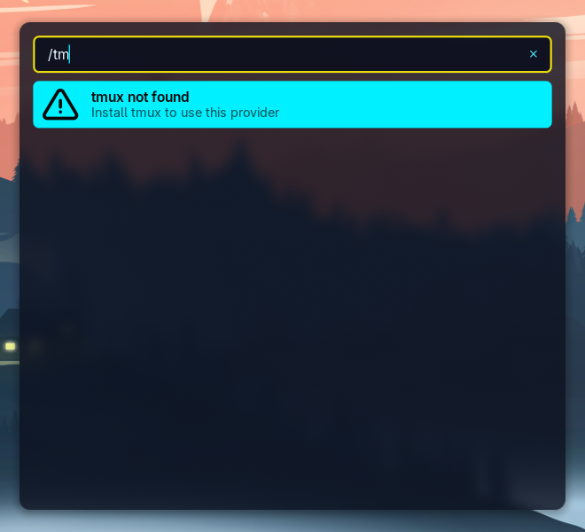
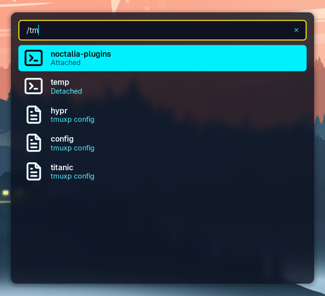

# tmux Provider

A launcher provider plugin for searching running tmux sessions, or tmuxp configurations, and
attaching the sessions.

## Plugin

| Field           | Value                         |
| --------------- | ----------------------------- |
| ID              | `dunarand/tmux-provider`      |
| Entry           | Launcher provider: `provider` |
| Launcher Prefix | `/tm`                         |

## Requirements

- Noctalia v5.0.0 or higher
- Requires `tmux`: [Install tmux](https://github.com/tmux/tmux/wiki/installing)
- `tmuxp`: Optional dependency, [install tmuxp](https://tmuxp.git-pull.com/)

tmuxp is completely optional. If you want tmuxp configurations to be included in the search, enable
tmuxp option in the plugin settings.



## Usage

Simply open your launcher and type the session you're looking for after the `/tm` prefix.



Selecting an entry and pressing Return / Enter launches the default terminal and attaches the tmux
session.

## Settings

| Setting     | Type   | Default | Description                                                |
| ----------- | ------ | ------- | ---------------------------------------------------------- |
| `use_tmuxp` | `bool` | `false` | Enables tmuxp configurations to be included in the search. |

## Notes

**Limitations:**

- With the current implementation, we attach sessions via the following commands:

  - **tmux:**

    ```
    tmux attach -t <session>
    ```

  - **tmuxp:**

    ```
    tmuxp load <session>
    ```

- The current implementation only utilizes tmuxp. Other tmux configuration tools such as tmuxinator
  will be added in the future.
